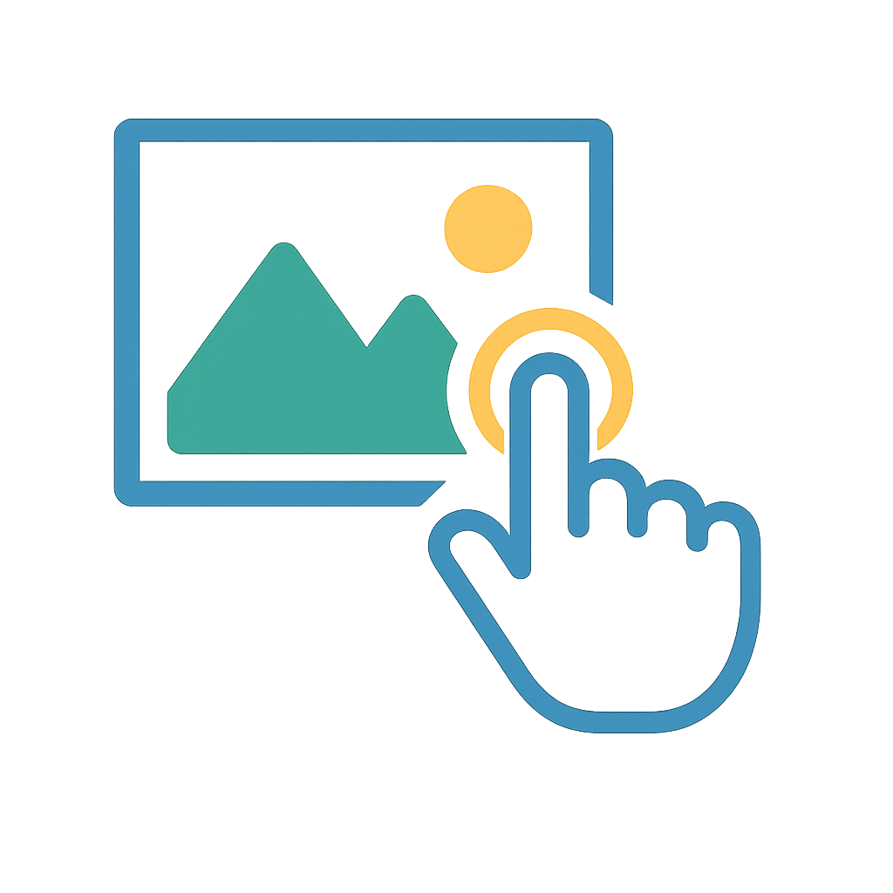
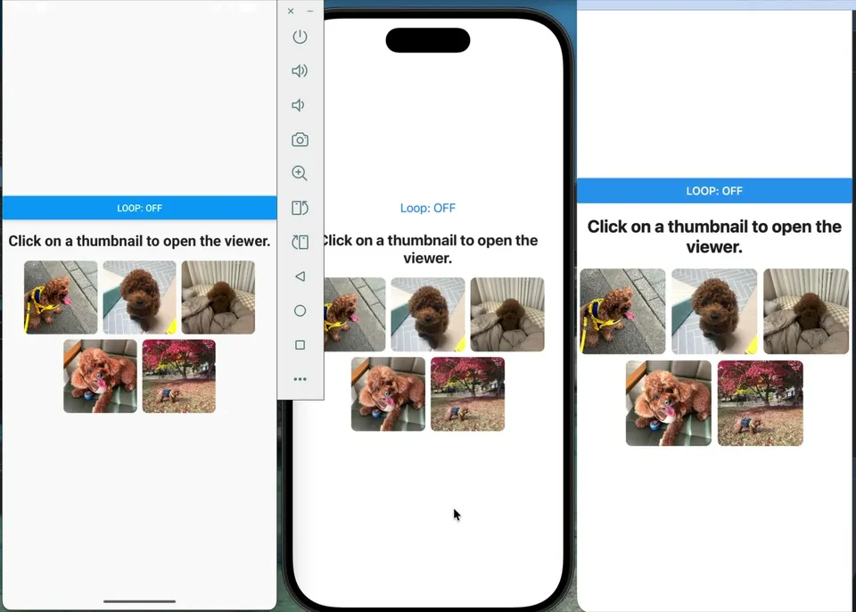

# React Native Gesture Image Viewer

> English | [한국어](./README-ko_kr.md)

<div align="center">
  
</div>

## Overview

Have you ever struggled with implementing complex gesture handling and animations when building image galleries or content viewers in React Native?

Existing libraries often have limited customization options or performance issues. `react-native-gesture-image-viewer` is a high-performance **universal gesture viewer** library built on React Native Reanimated and Gesture Handler, providing complete customization and intuitive gesture support for not only images but also videos, custom components, and any other content.

<p align="center">
  
</p>

### Key Features

- 🤌 **Complete Gesture Support** - Pinch zoom, double-tap zoom, swipe navigation, pan when zoomed-in, and vertical drag to dismiss
- 🏎️ **High-Performance Animations** - Smooth and responsive animations at 60fps and beyond, powered by React Native Reanimated
- 🎨 **Full Customization** - Total control over components, styles, and gesture behavior
- 🎛️ **External Control API** - Trigger actions programmatically from buttons or other UI components
- 🧩 **Multi-Instance Management** - Manage multiple viewers independently using unique IDs
- 🧬 **Flexible Integration** - Use with Modal, [React Native Modal](https://www.npmjs.com/package/react-native-modal), ScrollView, FlatList, [FlashList](https://www.npmjs.com/package/@shopify/flash-list), [Expo Image](https://www.npmjs.com/package/expo-image), [FastImage](https://github.com/DylanVann/react-native-fast-image), and more
- 🧠 **Full TypeScript Support** - Great developer experience with type inference and safety
- 🌐 **Cross-Platform** - Runs on iOS, Android, and Web with Expo Go and New Architecture compatibility
- 🪄 **Easy-to-Use API** - Simple and intuitive API that requires minimal setup

## Quick Start

### 📚 Documentation

Full documentation is available at: <https://react-native-gesture-image-viewer.pages.dev>

### Examples & Demo

- [📁 Example Project](/example/) - Real implementation code with various use cases
- [🥠 Expo Go](https://snack.expo.dev/@harang/react-native-gesture-image-viewer-v2) - Try it instantly on Expo Snack

### 🤖 AI

- [llms.txt](https://react-native-gesture-image-viewer.pages.dev/llms.txt): A structured index file containing the titles, links, and brief descriptions of all documentation pages.
- [llms-full.txt](https://react-native-gesture-image-viewer.pages.dev/llms-full.txt): A full-content file that concatenates the complete content of every documentation page into a single file.

### Basic Usage

`react-native-gesture-image-viewer` is a library focused purely on gesture interactions for complete customization.

```tsx
import { useCallback, useState } from 'react';
import { ScrollView, Image, Modal, View, Text, Button, Pressable } from 'react-native';
import {
  GestureViewer,
  GestureTrigger,
  useGestureViewerController,
  useGestureViewerEvent,
  useGestureViewerState,
} from 'react-native-gesture-image-viewer';

const images = [
  { uri: 'https://picsum.photos/400/200', width: 400, height: 200 },
  { uri: 'https://picsum.photos/200/400', width: 200, height: 400 },
  { uri: 'https://picsum.photos/300/300', width: 300, height: 300 },
];

function getImageDimensions(image: (typeof images)[number]) {
  return { width: image.width, height: image.height };
}

function App() {
  const [visible, setVisible] = useState(false);
  const [selectedIndex, setSelectedIndex] = useState(0);

  const { goToIndex, goToPrevious, goToNext } = useGestureViewerController();

  const { currentIndex, totalCount } = useGestureViewerState();

  const openModal = (index: number) => {
    setSelectedIndex(index);
    setVisible(true);
  };

  const renderImage = useCallback((image: (typeof images)[number]) => {
    return (
      <Image
        source={{ uri: image.uri }}
        style={{ width: '100%', height: '100%' }}
        resizeMode="contain"
      />
    );
  }, []);

  useGestureViewerEvent('zoomChange', (data) => {
    console.log(`Zoom changed from ${data.previousScale} to ${data.scale}`);
  });

  return (
    <View>
      {images.map((image, index) => (
        <GestureTrigger key={image.uri} onPress={() => openModal(index)}>
          <Pressable>
            <Image source={{ uri: image.uri }} />
          </Pressable>
        </GestureTrigger>
      ))}
      <Modal transparent visible={visible}>
        <GestureViewer
          data={images}
          initialIndex={selectedIndex}
          renderItem={renderImage}
          getItemDimensions={getImageDimensions}
          ListComponent={ScrollView}
          onDismiss={() => setVisible(false)}
        />
        <View>
          <Button title="Prev" onPress={goToPrevious} />
          <Button title="Jump to index 2" onPress={() => goToIndex(2)} />
          <Button title="Next" onPress={goToNext} />
          <Text>{`${currentIndex + 1} / ${totalCount}`}</Text>
        </View>
      </Modal>
    </View>
  );
}
```

When dimensions are learned from an image load callback and object items may be recreated, provide
`getItemKey={(item) => item.uri}` (or another stable unique key). This preserves dimensions when the
same logical item is recreated at the same index without reusing them after replacement or reorder.

## Contributing

For details on how to contribute to the project and set up the development environment, please refer to the [Contributing Guide](CONTRIBUTING.md).

## License

[MIT](./LICENSE)
